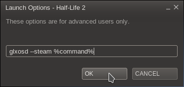

* TOC_GOES_HERE
{:toc}

# General usage #

To use GLXOSD you'll need to launch the application you want it to display in using the `glxosd` command. All you have to do is prefix the command you use to launch the application with <code>glxosd </code>. For example, if you want to launch glxgears, you will have to run this:

glxosd glxgears


And if you want to run Minecraft, you'll have to run this:

glxosd java -jar Minecraft.jar


To remove the need of launching the application through the terminal, you should just edit the launcher for that application to include GLXOSD in the command.

# Steam games #

1. Right click on the game in Steam.\\

2. Click "Properties" in the context menu.\\

3. Click "SET LAUNCH OPTIONS..." in the properties window.\\

4. Paste `glxosd --steam %command%` into the text box that appears.\\

5. Click OK.\\

6. And finally, click Close.

7. Done! You can now start the game and you should see GLXOSD in it. If the game starts without GLXOSD or doesn't start at all, please [send me an email](mailto:nickguletskii200@gmail.com) or file an issue on the [issue tracker](https://github.com/nickguletskii/GLXOSD/issues?state=open).

# Turning the OSD off and on

The default shortcut for turning the GLXOSD on and off is <kbd>Shift</kbd> + <kbd>F10</kbd>. You can change this in the [config file]({{site.baseurl}}/faq.html#how-do-i-customise-glxosd).

# Benchmarking #

The default shortcut for starting and stopping GLXOSD frame logging is <kbd>Shift</kbd> + <kbd>F9</kbd>. The default output location for GLXOSD frame timing logs is /tmp/. Both of these options can be configured through the [config file]({{site.baseurl}}/faq.html#how-do-i-customise-glxosd).

When logging starts, a file in the output directory will be created. The filename of that file will be in the format of "PROCESSID_CURRENTTIME_ID.log". 

It contains a line per frame, each one of them has two comma-separated numbers: the ID of the X11 drawable and the number of nanoseconds that have elapsed since logging started. Please note that the overhead of logging is bigger than a nanosecond, therefore you can't really say that we are measuring with nanosecond precision here.

To make benchmarking more fair, please put the output location on a fast filesystem.

# Additional options #

glxosd [options] command

### Launch with a different config ###

--config PATH_TO_CONFIG


or:


-c PATH_TO_CONFIG


Example:


glxosd --config ~/myglxosdconfig.conf glxgears


### Launch GLXOSD with Steam overlay ###

--steam


or:


-s


Example:


glxosd --steam glxgears


### Specify the path to Steam ###


--steam PATH_TO_STEAM


Example:


--steam-path ~/.local/share/Steam 
